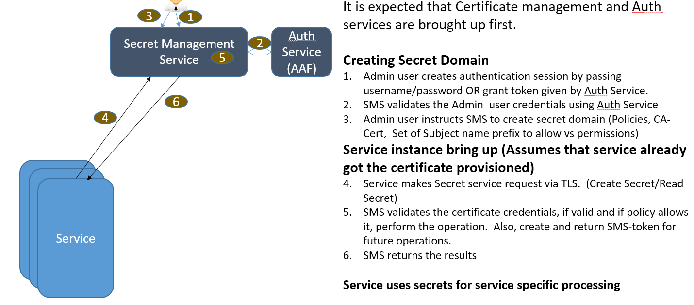

.. This work is licensed under a Creative Commons Attribution 4.0 International License.
.. http://creativecommons.org/licenses/by/4.0
.. Copyright 2018 Intel Corporation, Inc

SMS-Secret Management Service
==================================

.. toctree::
   :maxdepth: 1

   installation
   usage
   apiswagger

Introduction
------------

This project aims at the Storage of sensitive information such as passwords.

**Current state and gaps**

Many services in ONAP use password based authentication. Eg: Database servers, publish/subscribe brokers etc.
Passwords are stored in plain text files in many services.
With multiple instances of these services, the attach surface area becomes very big.
Hence there is a need to ensure that attack surface related to password exposure is reduced.

**Requirement:**

Need for secure secret management. Services are expected to get the secret only on needed basis using secret reference and remove the secrets once they are used up.

**Secret Service High Level Flow Diagram**

